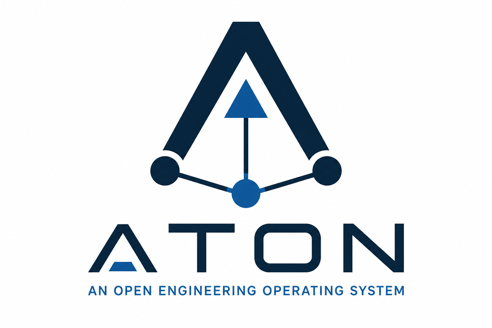

<p align="center">
  
</p>

<h1 align="center">ATON</h1>

<p align="center">
  <strong>An Open Engineering Operating System</strong>
</p>

<p align="center">
  Built around a versioned Engineering Knowledge Graph.
</p>

---

## Vision

Modern engineering relies on many specialized tools for requirements management, systems modeling, testing, project management and documentation.

Although these tools often describe the same system, they maintain separate data models and repositories, making engineering knowledge fragmented and difficult to manage.

ATON provides a common engineering platform that connects engineering knowledge instead of engineering tools.

Its foundation is a versioned Engineering Knowledge Graph that enables traceability, collaboration and extensibility across engineering disciplines.

## Core Principles

- Everything is an Artifact
- Relationships are First-Class
- Everything is Versioned
- Knowledge over Documents
- Git is the Source of Truth
- Open by Design

## Architecture

ATON consists of a small Kernel that provides generic engineering infrastructure.

Engineering capabilities such as Requirements Management, MBSE, Test Management or Risk Management are implemented as extensions on top of the Kernel.

```text
                  Engineer
                      │
                      ▼
         Engineering Capabilities
──────────────────────────────────────────
 Requirements   MBSE   Tests   Risks   PM
──────────────────────────────────────────
              Kernel Services
──────────────────────────────────────────
 Artifact  Relation  Version
 Review    Baseline
──────────────────────────────────────────
     Engineering Knowledge Graph
──────────────────────────────────────────
          Git Repository Storage
```

## Repository Structure

```text
book/            Project documentation

aton-model/      Engineering domain model

aton-kernel/     Kernel services

aton-git/        Git persistence

aton-rest/       REST API

aton-web/        Web frontend

aton-ai/         AI capabilities

examples/        Example projects
```

## Documentation

The ATON Book is the authoritative specification of the project.

Documentation is written before implementation.

## Project Status

🚧 **Foundation Phase**

The architecture, documentation and domain model are currently being established before implementation begins.

## Roadmap

- **v0.1** Foundation
- **v0.2** Kernel
- **v0.3** Persistence
- **v0.4** REST API
- **v0.5** Web UI

## Contributing

Contributions are welcome.

Please read the contribution guidelines before submitting pull requests.

## License

Licensed under the Apache License 2.0.
